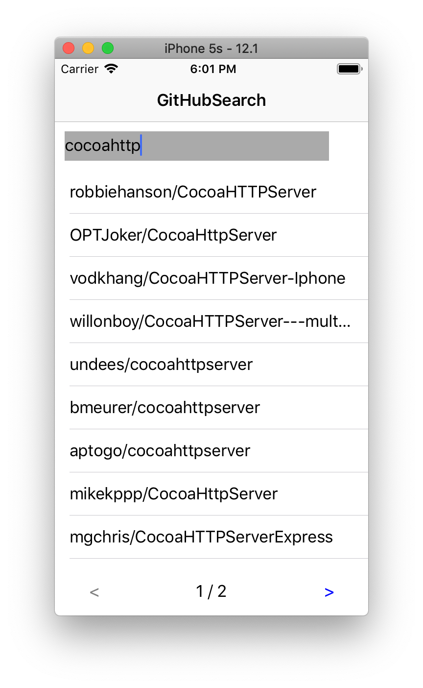

# GitHubSearch
 
An application allow user to search GitHub repo on iOS device.

Run the default UI test __testUserSearchFlow__ to see what you can do whit it.

Have fun.

__Only support iPhone currently__

